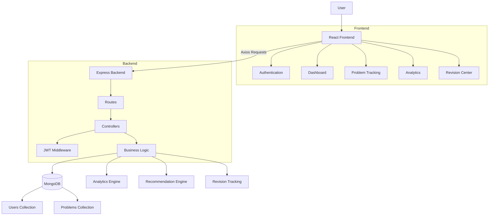
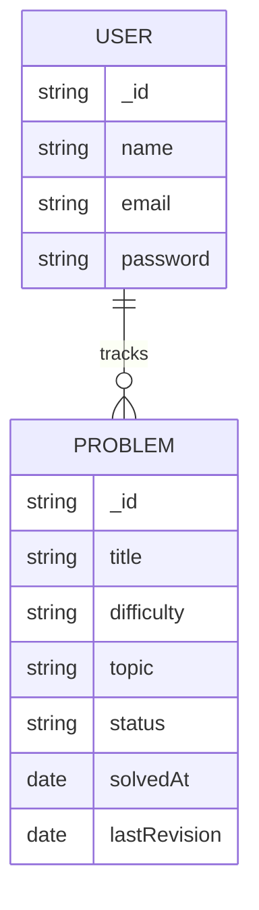

# 🚀 PrepTracker


## 📖 About

PrepTracker is a full-stack MERN application designed to help software engineering candidates manage coding interview preparation efficiently. It provides centralized problem tracking, analytics, revision scheduling, and performance insights to support consistent learning and long-term retention.

---

### 🎯 Key Achievement

Designed and deployed a full-stack MERN application with authentication, analytics, revision tracking, and automated cloud deployment using Vercel and Render.

---

## 🌐 Live Demo

### Frontend (Vercel)

🔗 https://interview-prep-platform-project.vercel.app

The frontend is deployed on Vercel and automatically updates whenever changes are pushed to GitHub.

#### Environment Variable

VITE_API_URL=https://preptracker-api-iyr8.onrender.com

### Backend (Render)

🔗 https://preptracker-api-iyr8.onrender.com

The backend is deployed on Render and connected to MongoDB Atlas.

#### Environment Variables

MONGO_URI=<your_mongodb_connection_string>
JWT_SECRET=<your_jwt_secret>
NODE_ENV=production

---

## 🧪 Demo Account

Email: test@example.com
Password: 123456

> Feel free to explore all features using the demo account.

---

## 🚀 Deployment Workflow

### Frontend Deployment (Vercel)
1.Push changes to GitHub.
2.Vercel automatically detects new commits.
3.The application is rebuilt and deployed.
4.The latest version becomes available on the live URL.

### Backend Deployment (Render)
1.Push backend changes to GitHub.
2.The backend is rebuilt and redeployed.
3.API changes become available on the live backend URL.

> ⚠️ Note: This backend is hosted on Render’s free tier.  
> It may take **20–30 seconds to respond after inactivity** because the server goes to sleep.  
> The first request after inactivity may be slow (cold start), but subsequent requests are fast.

---

##  📌Overview

A full-stack coding interview preparation platform that helps developers organize coding problems, track progress, maintain revision schedules, and build consistent problem-solving habits.

PrepTracker transforms scattered notes and spreadsheets into a centralized dashboard for managing your DSA and interview preparation journey.
Instead of solving problems on the platform, users:

* Track solved problems
* Analyze performance
* Identify weak areas
* Maintain consistency

---

## 🌟Why PrepTracker?

Coding interview preparation often involves solving 300–500+ problems across topics such as Arrays, DP, Graphs, Trees, and Greedy Algorithms. Tracking progress manually through spreadsheets becomes inefficient and makes it difficult to identify weak areas. PrepTracker centralizes preparation into a single dashboard with analytics, revision tracking, and performance insights.

PrepTracker solves this by providing:

✅ Problem Tracking
✅ Progress Analytics
✅ Revision Management
✅ Smart Recommendations
✅ Performance Insights
✅ Consistency Tracking

---

## ✨ Key Features

### 1- 🔐Secure Authentication
* JWT-based authentication
* Protected routes
* Secure user sessions

### 2- 📝 Problem Tracking
* Add coding problems
* Mark problems as solved or unsolved
* Search and filter tracked problems
* Categorize by difficulty

### 3- 📊 Analytics Dashboard
* Total problems tracked
* Solved vs unsolved breakdown
* Focus area identification
* Streak tracking
* Progress visualization

### 4- 📈 Interactive Progress Analytics
* Difficulty-wise progress tracking
* Visual charts and statistics
* Performance insights

### 5- 📚 Revision Center
* Review previously solved problems
* Track last revision dates
* Identify overdue problems
* Strengthen long-term retention

### 6- 🎯 Smart Recommendations
* Suggest problems based on progress
* Encourage balanced practice
* Help improve weak areas

### 7- 📱 Responsive Design (In-Progress)
* Desktop-friendly interface
* Mobile-responsive layout
* Consistent user experience

---

## 🛠️ Tech Stack

### Frontend

* React.js
* React Router
* Tailwind CSS
* Recharts
* Axios
* React Toastify

### Backend

* Node.js
* Express.js
* Database
* MongoDB
* Mongoose

###  Authentication System 

* User Registration
* Secure Password Hashing (bcrypt)
* Login with credential validation
* JWT Token Generation
* Protected Routes using Middleware
  
#### 🚧 Deployment

* Backend: Render
* Frontend: Vercel
* Database: MongoDB Atlas

---

## 🏗️ System Architecture



---

## 🖼️ Application Screenshots

### 🏠 Home Page

The landing page introduces PrepTracker and highlights its core capabilities.


### 📊 Dashboard Overview

A centralized dashboard displaying progress metrics, achievements, streaks, and coding statistics.


### 📈 Progress Tracking

Visual representation of coding progress across different difficulty levels.


### 📝 Problem Tracking

Track coding problems, update status, search problems, and organize interview preparation efficiently.


### 🎯 Recommended Problems

Personalized recommendations to encourage continuous learning.


### 📚 Revision Center

Review previously solved problems and maintain long-term retention through structured revision.


### 📈 Analytics Page

Personalized analytics to improve and track performance.


--- 

## 🎥 Demo

Login
Dashboard
Add Problem
Analytics
Revision Center


---


## 📂 Project Structure 
### ⚙️ Backend Architecture

Follows **MVC Pattern**:

```bash
backend/
│
├── config/        # DB connection
├── controllers/   # Business logic
├── models/        # Schemas
├── routes/        # API routes
├── middleware/    # Auth middleware
├── server.js
├── index.js
├── package.json
├── .env
```

---

### ⚙️ Frontend Architecture

```bash
frontend/
│
├── src/
│   ├── api/
│   ├── components/
│   ├── context/
│   ├── pages/
│   ├── layouts/
│   └── App.jsx
│
├── index.html
├── tailwind.config.js
├── vite.config.js
└── package.json
```
---

## 🗄️ Database Schema


---

## 🔌 API Endpoints

### Authentication

POST /api/auth/register 
POST /api/auth/login 
GET /api/auth/profile

### Problems

GET /api/problems
POST /api/problems
GET /api/problems/:id
PUT /api/problems/:id
DELETE /api/problems/:id

### Tracking

GET    /api/tracking
POST   /api/tracking
PUT    /api/tracking/:trackingId
DELETE /api/tracking/:trackingId

### Dashboard

GET /api/dashboard
Activity History
GET /api/activity


---

## ⚙️ Setup Instructions

### 1. Clone Repository

```bash
git clone https://github.com/HARSHITA-SRIVASTAVA/InterviewPrepPlatform_Project.git

cd InterviewPrepPlatform_Project
```

### 2. Backend Setup

```bash
cd backend
npm install

Create a .env file inside the backend folder:
PORT=5000
MONGO_URI=your_mongodb_connection_string
JWT_SECRET=your_secret_key

Start backend server:
npm run dev

```

### 3.Frontend Steup

```bash
cd frontend
npm install
npm run dev
```

Application will run at:

```bash
http://localhost:5173
```

---

## 📌 Project Highlights

- Full-Stack MERN Architecture
- JWT Authentication
- RESTful API Architecture
- MVC Backend Structure
- Interactive Data Visualization
- Responsive Dashboard Design
- Protected Routes
- Revision Tracking System
- GitHub + Vercel + Render CI/CD Deployment
  
---

## 🚀 Future Enhancements

### Phase 1
-  [ ] Dark Mode
-  [ ] Export Progress Reports
-  [ ] Contest Tracking

### Phase 2
- [ ]  LeetCode API Integration
- [ ]  Weekly Email Reports
- [ ]  Topic-wise Learning Paths

### Phase 3
-  [ ] AI-Powered Revision Suggestions
-  [ ]  Spaced Repetition System

---

## 📈 What I Learned

This project helped strengthen my understanding of:

* Full-Stack Application Development
* React State Management
* REST API Design
* JWT Authentication
* MongoDB Data Modeling
* Dashboard UI Design
* Data Visualization with Recharts
* Responsive Design Principles

---

## 🧩 Challenges & Solutions

### 1.Authentication & Protected Routes

Managing user sessions across multiple pages was challenging. I solved this using JWT authentication, React Context API, and protected routes to ensure secure access control.

### 2.Analytics Visualization

Transforming raw tracking data into meaningful charts required data aggregation and debugging Recharts rendering issues. Proper data formatting and responsive chart containers resolved these challenges.

### 3.Revision Tracking Logic

Designing a useful revision system required identifying problems that needed review based on previous activity. I implemented date-based revision tracking to encourage long-term retention.

### 4.UI Consistency & Scalability

As more pages were added, maintaining consistent layouts became difficult. I created a reusable Dashboard Layout component to centralize shared UI elements such as the sidebar and header.

### 5.Responsive Design
Building a dashboard that worked across different screen sizes required careful use of Tailwind's responsive utilities and flexible grid layouts.

---

## 🤝 Contributing

Contributions, ideas, and suggestions are welcome.

1.Fork the repository
2.Create a feature branch
3.Commit changes
4.Open a Pull Request

---

## 👨‍💻 Author

Harshita Srivastava

---
